> Converted from the creator's supplied sheet: `~/Desktop/instrutions/Groww Long Video - Script to Edit Instruction Sheet.docx` (2026-08-16).
> This is the VERBATIM source of truth. The workspace adaptation lives in `../style.md` (Part A) and `../edit-workflow.md` (Part B);
> where they and this sheet disagree, flag it — do not silently pick one.

**INTELLIGENT INVESTORS × GROWW**

**Long-Form Video**

*Script-to-Edit Instruction Sheet*

The complete visual specification for every Groww mutual-fund long video
--- every mandatory rule, every frame type, every animation and every
transition --- plus the agent workflow that turns a raw script into an
approved, shot-by-shot edit plan.

+----------------------------------------------------------------------+
| **Read this first**                                                  |
|                                                                      |
| This sheet has two halves and they are used differently.             |
|                                                                      |
| PART A (§1--§9) is the specification. It is the ground truth for how |
| a Groww long video looks and behaves. Nothing in Part A is optional  |
| unless it says so.                                                   |
|                                                                      |
| PART B (§10--§14) is the workflow. It tells an agent how to take a   |
| script, decide which frame goes where, prove the output against the  |
| real published videos, and stop for approval.                        |
|                                                                      |
| §2 is the one to read twice. It is the Visual & Data Editing         |
| Framework --- what the creator never says out loud, what must still  |
| reach the screen, and how accurately. It governs everything else in  |
| this sheet.                                                          |
|                                                                      |
| Every run opens with a /grill-me session --- the agent interviews    |
| you until it has complete context, and assumes nothing (§10.2). Then |
| the gauntlet-loop skill drives the workflow, the creator plates are  |
| keyed with corridorkey-green-screen and ffmpeg-chromakey, and        |
| everything that moves is built with emilkowalski-motion and audited  |
| with impeccable. Install all six before you start --- §3.6, §4 and   |
| §10.                                                                 |
+----------------------------------------------------------------------+

**Contents**

§1 Non-negotiable rules

§2 The Visual & Data Editing Framework

§3 Brand and design system

§4 Plate preparation --- keying the creator and generating the
background

§5 The opening block --- 00:00 to the brand transition

§6 The comparison block --- icons, pie and benchmark

§7 The deep-dive block --- AUM, fund managers, approach

§8 Tables, graphs and screenshots

§9 Transitions

§10 The workflow --- installing and running the gauntlet loop

§11 The eight frame types

§12 Reference videos --- the quality bar

§13 The approval gate

§14 The paste-ready gauntlet prompt

**§1 Non-negotiable rules**

These apply to every Groww mutual-fund long video without exception. An
edit that breaks any of them is rejected before it is reviewed for
taste.

  --------------------------- -----------------------------------------------------------------------------------------------------------------------------------------------------------------------------------------------------------------------------------------------------------------
  **Rule**                    **What it means in the edit**
  **Disclaimer first**        Every long video opens on the disclaimer card for 2 seconds, with no audio. The card is supplied --- do not rebuild it.
  **Brand transition**        Where the script marks the end of the instruction section and the start of the main video, the default Groww transition plays. The transition video is supplied.
  **Subscribe unit**          Whenever the voice-over says like, share or subscribe, the "Mutual Funds with Groww" bar appears with a SUBSCRIBE button and a bell, and a cursor moves in and clicks both.
  **Every table is shown**    If the script contains a table, tabular column, graph, news element or screenshot, it must appear on screen. This is not a creative choice --- it is part of the Groww editing process. The full framework is §2, and it governs everything else in this sheet.
  **Every source is shown**   Every reference picture and screenshot carries its source line, visibly, below it in the final edit. A missing source attribution is a critical error (§2.5).
  **Logo lock-up**            "Intelligent Investors" sits top-left and the Groww logo sits top-right on every single frame, including B-roll and full-screen graphics.
  **One background system**   Every scene with no creator and only visuals uses the same background. Continuity across the video is mandatory.
  **Brand colour only**       Colour branding is used throughout. No off-brand colour enters any frame.
  --------------------------- -----------------------------------------------------------------------------------------------------------------------------------------------------------------------------------------------------------------------------------------------------------------

**§2 The Visual & Data Editing Framework**

+----------------------------------------------------------------------+
| **This is a very, very important framework**                         |
|                                                                      |
| Do not underestimate the absolute necessity of this workflow.        |
|                                                                      |
| Every reference video in §12 has strictly followed this exact        |
| framework. Do a deep frame-by-frame analysis of them and you will    |
| see text, tables and source attributions integrated seamlessly with  |
| motion graphics while the creator speaks, with data dissected to     |
| maintain visual pacing. You are expected to mirror that exact level  |
| of execution.                                                        |
+----------------------------------------------------------------------+

Every Groww script is two documents in one. One is the dialogue the
creator performs. The other is a body of reference material --- tables,
colour screenshots, black-boundary screenshots, charts, data points,
source lines and special markers --- that is never spoken aloud and
exists solely so that you, the editor, put it on screen. This section
governs that second document, and it outranks creative preference
everywhere it applies.

**2.1 The Unspoken Rule**

-   The creator will only ever voice the main dialogue. They will not
    vocalise or mention the tables, the data screenshots or the sources.

-   Those elements are placed in the script strictly for you, the
    editor, to include visually.

-   **Silence about an element is not permission to drop it.** It is the
    instruction to show it. If a visual is not referred to anywhere in
    the spoken lines, that is the normal case, not an exception.

**2.2 Mandatory inclusion of visual references**

-   **Never omit any table, screenshot or data point provided in the
    script.** Not one.

-   Scripts carry reference pictures, colour screenshots, black-boundary
    screenshots, tables, and data points such as framework diagrams and
    thematic charts. All of them are in scope.

-   Before an edit is called finished, inventory every visual asset in
    the script and tick each one off against a frame in the timeline. A
    missing asset is a failed edit, not a trim.

**2.3 Absolute data accuracy**

-   **Depicting the data exactly as it is presented in the script is
    very, very important.** No factual errors, no misrepresentation.

-   No rounding, re-ordering, re-labelling, unit-changing or tidying up
    of any figure. Every number, percentage, ratio, rank, date and
    period is carried across character for character as the script wrote
    it.

-   A figure like 18.36 is not 18.4. A negative like −17.08% is not
    −17%. A rupee figure in crore is written the way the script writes
    it.

-   Where the script places a value next to a category average or a
    benchmark, all of those columns go on screen together. Never show a
    fund\'s number stripped of the comparison the script set beside it.

-   Where the script states an as-of date for the data, that date goes
    on screen with it.

**2.4 Charts, curves and candlesticks**

Some scripts carry a candlestick chart, a line graph, a bar chart or a
returns plot. These are data, not decoration, and they are the easiest
thing in the whole edit to get quietly wrong --- a chart can look right
and be wrong.

-   **Reproduce the curve exactly.** Every peak, trough, crossover and
    inflection sits where the source puts it. Do not smooth, straighten,
    simplify or otherwise improve the shape of a line.

-   **Candlesticks are read body by body.** Open, high, low and close on
    every candle must match the source, and so must the colour
    convention that marks up from down. A candle drawn the wrong way
    round inverts the meaning of the frame.

-   **Keep the axes honest.** Same scale, same range, same baseline,
    same tick values as the source. Never crop or rescale an axis to
    make a movement look larger or smaller than it actually is.

-   Keep the legend, the series colours and the series order exactly as
    the source has them, so the fund, the benchmark and the category
    stay distinguishable and are never swapped for one another.

-   Where a chart plots multiple series, every series in the source is
    drawn. Dropping the benchmark or the category line to reduce clutter
    is a data error, not a design decision.

-   Carry the period the chart covers, its axis labels and its source
    line, exactly as §2.5 requires for any other visual.

-   **If you rebuild the chart as motion graphics** instead of showing
    the screenshot, it must plot the same values and land on the same
    shape. Animate the draw-on; never redraw the data.

-   **Verify before it ships.** Put the rendered chart next to the
    source image and check the shape point by point, not at a glance.
    This is one of the pieces the critic in §14 should be judging blind
    against the source.

**2.5 Source attribution is mandatory**

-   **Whenever a reference picture or screenshot is provided, the source
    text goes visibly below it in the final edit.** Missing a source
    attribution is a critical error.

-   Reproduce the source line exactly as the script writes it, including
    any date qualifier attached to it.

-   The source stays on screen for as long as the visual it belongs to,
    and it stays legible at the final delivery resolution.

-   If a single frame carries two visuals from different sources, each
    one carries its own source line.

**2.6 Specific text callouts**

-   Special markers must be explicitly displayed. A star marker such as
    "\* Direct Growth" under a table is put on screen, never dropped as
    clutter.

-   Bold labels in the script that name which fund a screenshot belongs
    to go on screen together with that screenshot, so the viewer always
    knows whose number they are looking at.

-   **The rule is simple:** if the script marks something, the mark
    reaches the screen.

**2.7 Precise timing**

-   **Exhibit the relevant data and screenshots at the exact moment the
    creator is speaking about that specific topic.** Not before it, not
    after it.

-   Anchor each asset to its trigger line in the voice-over, and hold it
    for that passage of dialogue.

-   When the creator moves to the next metric, the previous visual moves
    off. A stale visual over new dialogue is a timing error.

**2.8 Data dissection and continuous visual movement**

-   **The video must have continuous visual movement.** Do not hold on a
    single static frame or visual for too long.

-   If the creator talks about a specific data point for an extended
    period, dissect that single data point into multiple dynamic visual
    steps --- reveal one row at a time, isolate and enlarge the figure
    under discussion, bring the comparison column in second, animate a
    bar or a pie up to its value, then step to the next line.

-   **Dissection changes the pacing, never the numbers.** Even when
    broken down, the data must remain perfectly accurate to the source.

-   A screenshot that sits motionless for the length of a spoken
    paragraph is a defect, even if the data on it is correct.

**2.9 Motion graphics integration**

-   **Heavily utilise motion graphics** to animate these tables,
    screenshots and data points, so the screen stays dynamic and
    engaging throughout.

-   This is precisely what frame types 2, 5 and 6 (§11) exist for ---
    the data-carrying frames.

-   Build the motion with emilkowalski-motion and audit the result with
    impeccable, as set out in §3.6.

**Asset types, and what has to reach the screen**

  ------------------------------------------- --------------------------------------------------------------------------------------------------------------------------------------------------------------------------
  **Asset in the script**                     **What must reach the screen**
  **Bordered data screenshot**                The full panel, revealed row by row rather than cut to whole. Fund label above it, source line beneath it.
  **Colour deck slide from an AMC**           The slide, with each column, pillar or letter revealed in step with the line being spoken. Source and any as-of date beneath.
  **Plain black-bordered comparison table**   Every column the script printed, including benchmark and category average. Star marker and source beneath.
  **Bordered prose box**                      The box, with the specific figures the creator speaks pulled out and emphasised at the moment they are said.
  **Photo-grid screenshot**                   The grid, cards animating in rather than appearing at once. Source beneath.
  **Chart or graph screenshot**               The chart, with bars or lines animating on, every series drawn, axes and legend unchanged from the source, legible at delivery resolution, source beneath (§2.4).
  **Candlestick or line chart**               The curve reproduced point for point --- every peak, trough and crossover where the source puts it, candle bodies and up/down colours exact, axes never rescaled (§2.4).
  ------------------------------------------- --------------------------------------------------------------------------------------------------------------------------------------------------------------------------

**The finished-edit checklist**

Run this before the edit is called done. Any unticked line is a failed
edit, not a note for later.

-   Every table in the script is on screen.

-   Every screenshot and reference picture in the script is on screen.

-   Every data point is on screen and matches the script character for
    character.

-   Every chart matches the source curve for curve --- peaks, troughs,
    candle bodies, axes, legend and series order all unchanged.

-   Every visual carries its source line, visibly, beneath it.

-   Every star marker and every fund label the script printed is
    displayed.

-   Every asset lands on the exact line of dialogue it belongs to.

-   Nothing holds still long enough to read as a static frame.

+----------------------------------------------------------------------+
| **Authorisation and creative freedom**                               |
|                                                                      |
| To achieve this flawlessly you are fully authorised to use any       |
| high-level agents or advanced skills available. Create a dedicated   |
| agent for it, deploy a specific skill, and do whatever is necessary  |
| to ensure this data is exhibited seamlessly and creatively.          |
|                                                                      |
| You have full creative freedom over how the data is exhibited ---    |
| animations, transitions, layouts, dissection. Exhibiting the data    |
| without fail, and with total accuracy, is strictly mandatory and is  |
| not part of that freedom.                                            |
+----------------------------------------------------------------------+

**§3 Brand and design system**

**3.1 Typography**

-   Two typefaces, always mixed inside the same text block: Ivy Presto
    (serif) and Inter Tight (sans serif).

-   The serif carries the emphasised half of the line; the sans carries
    the neutral half. Never set a title in one family alone.

-   Text animates in word by word, in brand purple, with a right-to-left
    in-animation.

-   **Read "right to left" precisely:** the words do not fly in from the
    extreme right edge of the frame. Each word appears in its own final
    position, with that directional animation applied in place.

**3.2 Colour**

-   Brand purple is the primary. It carries the text animation, the
    strokes, the callout boxes and the chart fills.

-   Every colour in the video carries a subtle white gradient. Nothing
    is laid down flat.

-   Charts use company colours with a highlight colour for the segment
    being spoken about, and the pie fill itself is a subtle gradient.

-   Light leaks, when used on a transition, are in the brand\'s primary
    colour.

**3.3 Backgrounds**

-   Creator-less frames: a subtle grid background with a
    white-to-brand-purple gradient. The same background is reused for
    every such scene.

-   Creator frames: a generated background. Its placement is a conscious
    decision, not a default --- it is built and positioned so that when
    text or graphics appear over it, they pop with clean visibility and
    contrast.

-   A blur gradient sits behind on-screen text. It merges rather than
    sits on top, because it is matched to the background underneath it.

**3.4 Depth and finish**

-   Circles, fund icons and cards all carry a stroke to create depth.
    Motion on the stroke is preferred --- it reads as more visually
    engaging than a static one.

-   A subtle black gradient with a nicely feathered edge sits over the
    creator. Layer order matters: the gradient is in front of the
    creator and behind the text and illustrations.

-   B-roll is enhanced with a subtle dust or texture pass. It applies to
    both AI-generated and real footage.

-   Callout boxes are never plain. They carry an internal design and a
    subtle gradient of their own.

**3.5 Tooling**

-   Motion graphics and illustration: Higgsfield, Remotion or Envato ---
    whichever serves the purpose for that shot.

-   Real footage B-roll: Envato.

-   AI-generated B-roll: Higgsfield or the Kie AI MCP.

-   **Green-screen keying and background compositing:**
    corridorkey-green-screen and ffmpeg-chromakey. Full detail in §4.

-   **Motion craft and design discipline:** emilkowalski-motion and
    impeccable. Full detail in §3.6.

**3.6 Motion craft --- the two skills that raise it**

Everything above says what moves. These two skills govern how well it
moves. Install both and run them over every motion pass --- they are
what separates a frame that animates from a frame that feels designed.

**emilkowalski-motion**

-   Motion design distilled from Emil Kowalski\'s published animation
    work. Use it after a frame is laid out, to add the entrances, state
    changes and reveals that make it feel alive without turning it into
    a motion demo.

-   **Restraint is the point.** The skill\'s discipline is what carries
    into video: transform and opacity as the primary properties, roughly
    140--220 ms for a small element\'s entrance, and one consistent
    easing language across the whole video rather than a different curve
    per shot.

-   Those figures are the skill\'s defaults for interface controls ---
    read them as the easing discipline for on-screen element entrances,
    and scale the duration to the shot, never the curve.

Install: npx skills add https://github.com/nexu-io/open-design \--skill
emilkowalski-motion

**impeccable**

-   A shared design vocabulary that keeps the output off the AI
    defaults, rather than fixing them afterwards.

-   **23 single-word commands** --- polish, audit, critique, distill,
    animate, bolder, quieter --- so a frame can be steered with one word
    instead of a paragraph.

-   **27 deterministic anti-pattern rules** across typography, colour,
    layout and motion, on top of a catalogue of the patterns that expose
    AI defaults.

-   **Run it in brand mode, not product mode.** These frames are
    editorial, not app UI.

Install:
[[github.com/pbakaus/impeccable]{.ul}](https://github.com/pbakaus/impeccable)

**Where they apply**

-   **Type 5 and type 6 frames (§11).** "A lot of precision and easing
    in and out is required" is exactly the job emilkowalski-motion
    exists for.

-   Every in-animation in §3.1 --- the word-by-word text reveal, the
    bottom-to-top element entrances, the pop on the fund icons, and the
    motion on the stroke.

-   The piggy-bank progression, the rotating coins, the rotating
    football, the icons closing together, and the pie draw.

-   **Before the critic, not after.** Run impeccable\'s audit over a
    frame before it goes into the gauntlet loop, so the loop is not
    spending rounds on something a deterministic rule already catches.

**§4 Plate preparation --- keying the creator and generating the
background**

The creator is shot on a green screen. Every creator frame in this sheet
--- frame types 1, 2 and 3 --- begins as a keyed plate composited onto a
generated background. The "generated background" referred to throughout
§3.3 is produced at this stage. Nothing downstream can be judged until
the key is clean, so this runs first.

+----------------------------------------------------------------------+
| **Two skills do this work --- install both**                         |
|                                                                      |
| corridorkey-green-screen --- the primary keyer, for anything         |
| reaching the final cut.                                              |
|                                                                      |
| ffmpeg-chromakey --- the fast path: previews, batch passes, spill    |
| suppression and colour work.                                         |
+----------------------------------------------------------------------+

**4.1 Remove the green screen**

-   **corridorkey-green-screen --- use this on every creator plate.** It
    solves the unmixing problem: rather than cutting a matte, it
    separates the foreground from the green plate and predicts the true,
    un-multiplied colour of the foreground alongside a clean linear
    alpha. That is what keeps loose hair strands and the patterned
    jacket edge intact instead of chewing them into a hard outline.

-   **ffmpeg-chromakey --- the fast path and the fallback.** Use it for
    quick keys, batch passes over many clips, spill suppression, and the
    colour work that sits on top of a key.

-   **Rule of thumb:** corridorkey-green-screen for every frame that
    reaches the final cut; ffmpeg-chromakey for previews, for the sample
    stills at the approval gate (§13), and for clean-up passes layered
    over a Corridor key.

**4.2 Kill the spill before compositing**

-   Green spill on hair, shoulders and the jacket edge is the giveaway
    that a frame was keyed. Suppress it as part of the key, not as a fix
    afterwards.

-   Test the edge against both a bright background and a dark one. If it
    glows green on either, the key is not finished.

-   Do not erode the matte to hide spill. That eats the hair detail the
    Corridor key exists to preserve.

**4.3 Put in the generated background**

-   Composite the keyed creator onto a generated background, built as
    described in §3.3 --- its placement is a conscious decision,
    positioned so that when text and graphics land on top, they pop with
    clean visibility and contrast.

-   Match the plate to the background: colour temperature, black level,
    and grain all have to agree, or the composite reads as a cut-out
    pasted on.

-   Hold continuity --- the same background family runs across the whole
    video, exactly as the grid background does for the creator-less
    frames.

-   The subtle black gradient from §3.4 goes on after the composite: in
    front of the creator, behind the text and illustrations.

-   The logo lock-up sits on top of the finished composite, never
    underneath it.

**4.4 Deliverable format**

-   Export keyed plates with a straight, un-premultiplied alpha --- PNG
    with alpha, ProRes 4444, or EXR --- so the compositing stage still
    has real edge data to work with.

-   Keep the un-keyed original. Every re-key comes off the source plate,
    never off a previous export.

**§5 The opening block --- 00:00 to the brand transition**

**00:00 · Disclaimer**

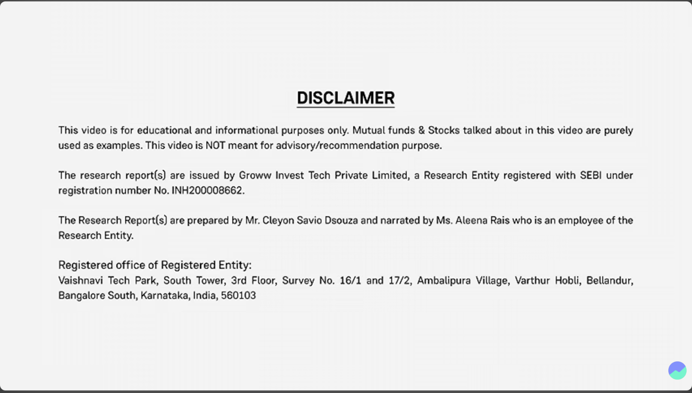

*Fig. 1 --- 00:00 · The supplied disclaimer card. Two seconds, no
audio.*

-   **MANDATORY.** Every mutual-fund long video starts with the
    disclaimer for 2 seconds.

-   The card is provided to you. Do not rebuild, re-typeset or re-time
    it.

-   No audio over it. Silence for the full two seconds.

**00:02 -- 00:05 · The hook**

*Fig. 2 --- 00:02--00:05 · Creator with text and motion graphics. Serif
and sans mixed, illustrations rising, football rotating.*

-   Motion graphics with illustrations, plus the hook line, over the
    creator.

-   Text is set in a mix of serif and sans serif --- Ivy Presto and
    Inter Tight.

-   A subtle black gradient with a nice feather sits over the creator:
    in front of the creator, behind the text and illustrations.

-   The illustrations animate bottom to top. The text comes in
    continuously alongside them.

-   Inside the illustration, the football itself is rotating. The small
    motion matters --- build it, do not use a static asset.

-   "Intelligent Investors" is locked top-left, the Groww logo
    top-right.

-   Build it in Higgsfield, Remotion or Envato --- whichever serves the
    purpose.

**B-roll · Football**

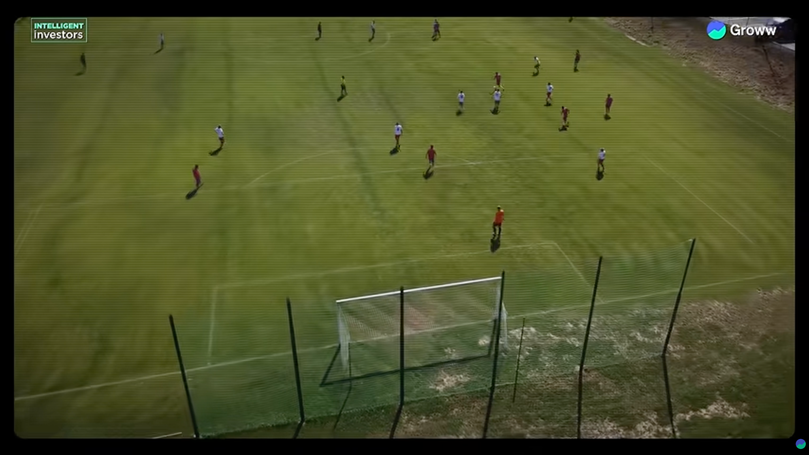

*Fig. 3 --- B-roll cut on the football reference. Black box on all four
sides, dust pass over the footage.*

-   When the voice-over talks about football, cut to B-roll: a football
    field, footballers, and similar. Source it from Envato.

-   Lay a subtle dust pass over the clip for visual enhancement.

-   The clip sits inside a black box that covers all four sides --- top,
    bottom, left and right.

-   **Transition rule:** every A-roll to B-roll change is a zoom in or a
    zoom out. A light leak in the brand\'s primary colour may be used
    with it.

**The funds in a race**

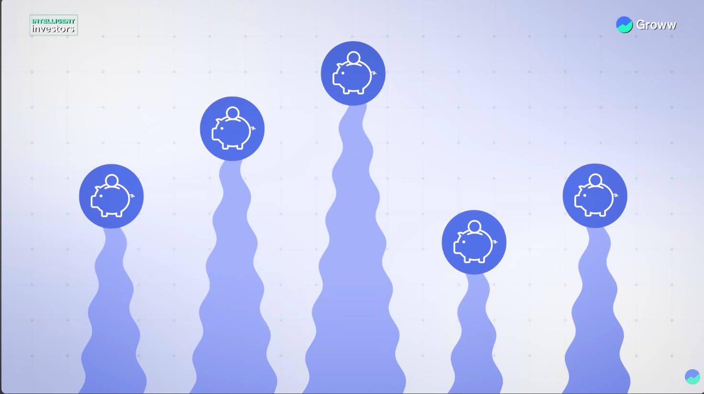

*Fig. 4 --- Only motion graphics. Piggy banks with wavy tails denoting
progression, on the grid background.*

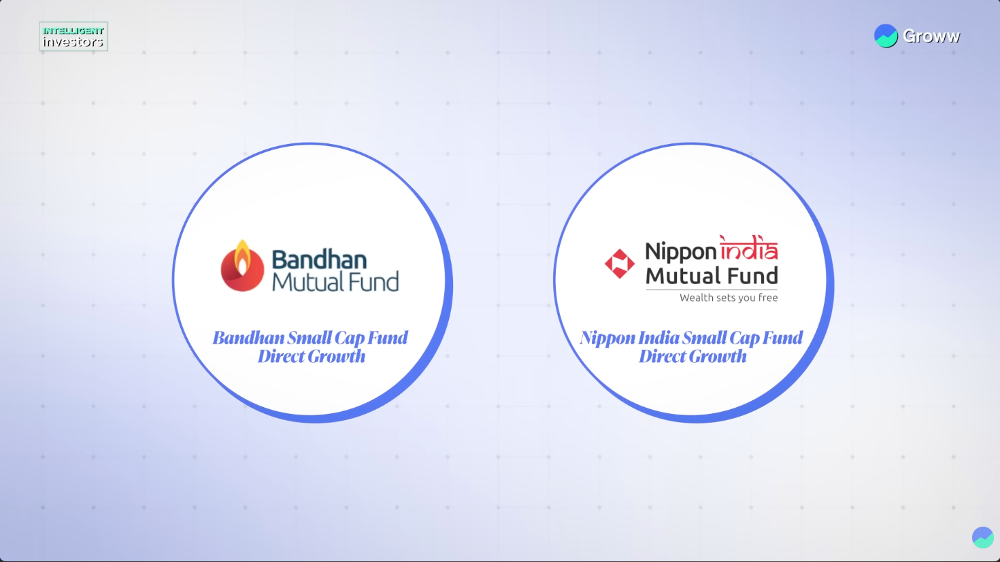

*Fig. 5 --- The same background carried through as the fund names are
listed. Circles carry a stroke for depth.*

-   To visualise that a lot of funds are in a race, use motion graphics
    of piggy banks with wavy tails --- the tail denotes progression.

-   Background: a subtle grid with a gradient of white and brand purple.
    Design theory is doing the work here, so keep it.

-   **Continuity:** for every scene with no creator and only visuals,
    this same background is used.

-   Fig. 5 is the scene where she lists the fund names. Every circle
    carries a stroke to create depth. Putting motion on that stroke
    would make it more visually engaging.

**Like, share and subscribe**

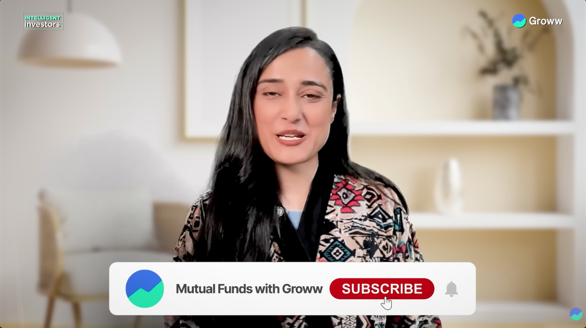

*Fig. 6 --- The mandatory subscribe unit, with the cursor mid-click.*

-   **MANDATORY.** Whenever the voice-over mentions like, share or
    subscribe, this unit appears.

-   The unit is a box reading "Mutual Funds with Groww" with a SUBSCRIBE
    button and a bell icon.

-   A cursor moves into frame, clicks the subscribe button, and then
    clicks the bell icon too. Both clicks are shown.

**The brand transition**

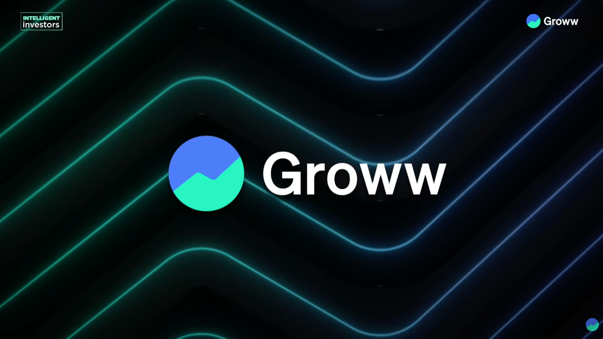

*Fig. 7 --- The default Groww transition frame, played before the topic
begins.*

-   Before delving into the topic, the company\'s transition frame
    plays.

-   The script will mark exactly where the instruction part ends and the
    main video starts. That is where this default transition goes.

-   The default transition video is supplied to you. Use it as given.

**§6 The comparison block --- icons, pie and benchmark**

**Important points for comparison**

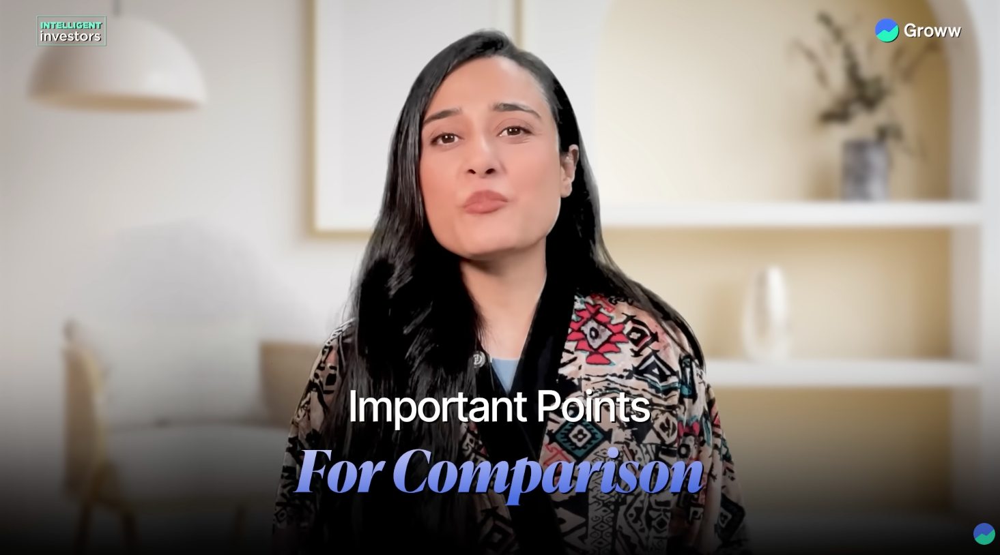

*Fig. 8 --- Creator with text. Serif and sans mixed, gradient present,
no VFX.*

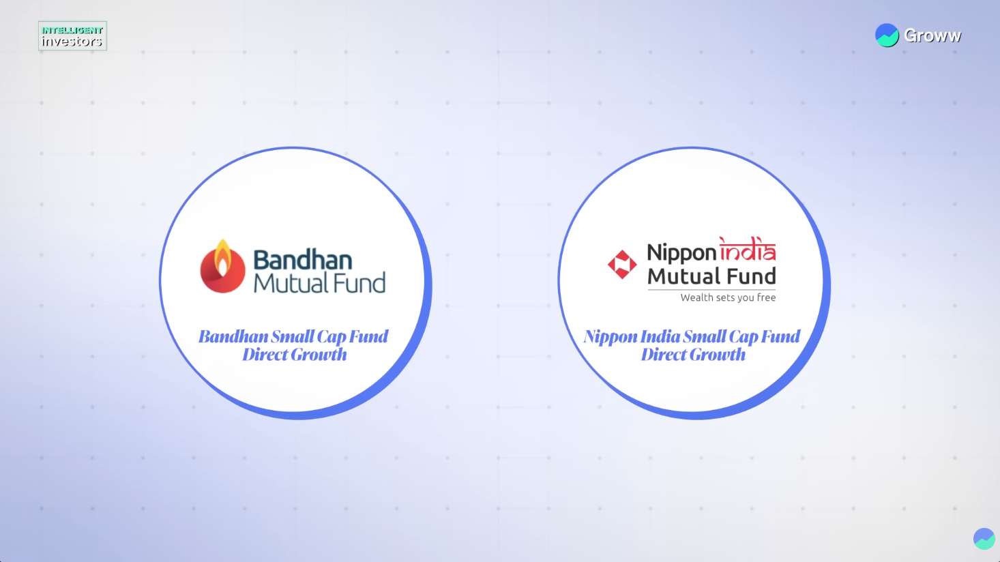

*Fig. 9 --- Only motion graphics. The two funds on the shared grid
background.*

-   Same mix of serif and sans serif with the gradient described in §3.
    Keep it clean.

-   The fund circles carry the same stroke and the same background as
    every other creator-less frame.

**The two funds resolve into one category**

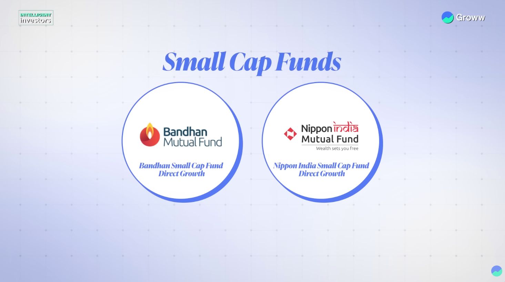

*Fig. 10 --- The icons after they close in, retitled "Small Cap Funds".*

This is a sequenced beat, not a single frame. Build it in this exact
order:

1.  The two fund icons come on screen as the voice-over names the funds.
    Each icon has a depth stroke and enters with a pop animation.

2.  When the voice-over says both are small cap funds, the two icons
    move closer together and shrink slightly.

3.  The text over them resolves to "Small Cap Funds", animating in word
    by word, in brand purple, with the right-to-left in-animation
    described in §3.1.

4.  Both icons then dissolve out.

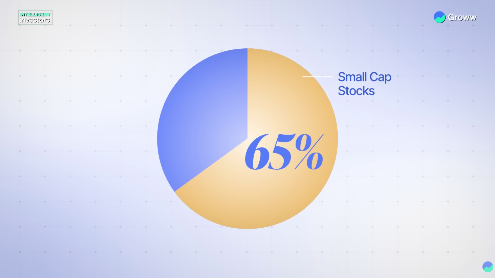

*Fig. 11 --- The pie animation. Brand colours, subtle gradient fill,
highlight colour on the spoken segment.*

-   Next, a pie graph animates in using the company\'s own colours.

-   The pie fill is a subtle gradient, not flat. Brand colours with a
    highlight colour on the segment being discussed.

-   As everywhere in the video, all colours carry a subtle white
    gradient.

-   This lands exactly on the line where the voice-over states that
    small caps are 65% for these funds.

**Benchmark and launch date**

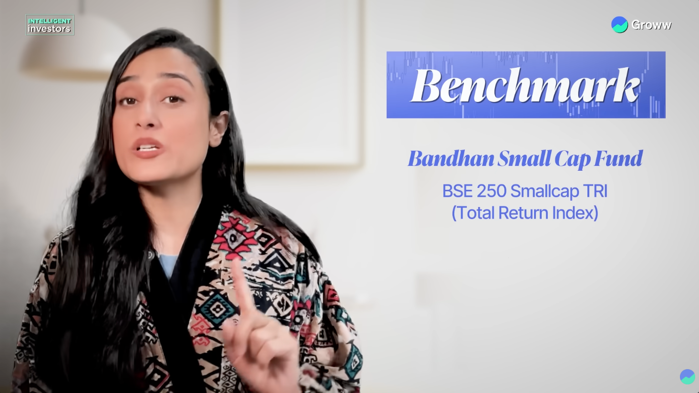

*Fig. 12 --- Creator with text. Benchmark for the first fund; the
creator has been moved left to open up the right side.*

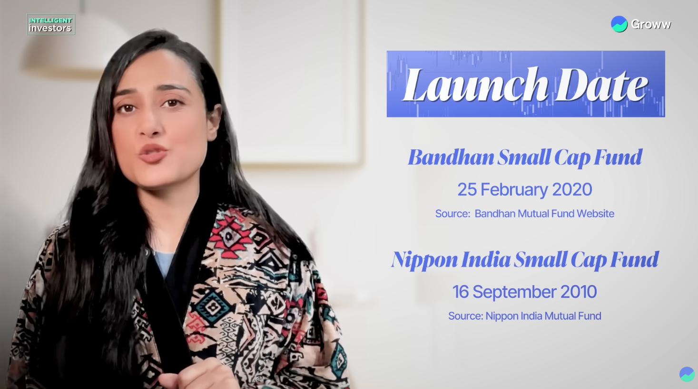

*Fig. 13 --- The same construction for launch date, with the dates
inside a designed callout box.*

-   This is the text-with-creator frame, and it appears when the
    voice-over talks about the benchmark of these funds.

-   Every element has an in-animation, and every one of them travels
    bottom to top.

-   A blur gradient sits behind the text. It merges cleanly because it
    is matched to the background it sits on.

-   The background is a generated background. Its placement was a
    conscious decision --- it was built and positioned so that when the
    text or graphics appear, they pop, with good visibility and
    contrast.

-   The launch date goes inside a callout box. The box is not plain: it
    carries its own design and a subtle gradient.

-   The creator sits on the left of the frame. She was deliberately
    moved left to make space for these elements to enter.

-   **Repeat for the second fund.** Fig. 12 shows only Bandhan Small Cap
    Fund\'s benchmark, but the same text treatment and the same
    in-animation are used to show Nippon India Mutual Fund\'s as well.

**§7 The deep-dive block --- AUM, fund managers, approach**

**AUM**

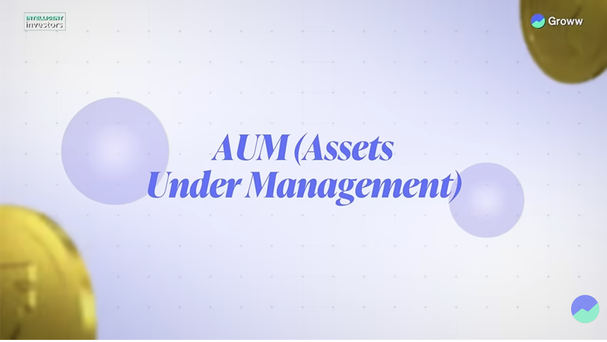

*Fig. 14 --- Only text. Sub-topic card with coins rotating in the
corners.*

-   This frame appears whenever the script opens a sub-topic --- here
    the voice-over in Hinglish is "Noww let\'s talk about AUM (Assets
    Under Management)".

-   The background is the same one used in the frames before it, with
    one addition: coins that carry a rotate animation.

-   Every sub-topic in the script gets this treatment. It is how the
    viewer knows a new section has started.

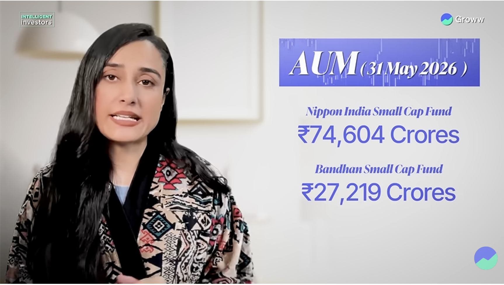

*Fig. 15 --- Going deeper on the same topic. The same frame
construction, kept for continuity.*

-   When going deep into the sub-topic, the same kind of frame is
    reused. Continuity is the point --- do not redesign it per section.

**Fund managers**

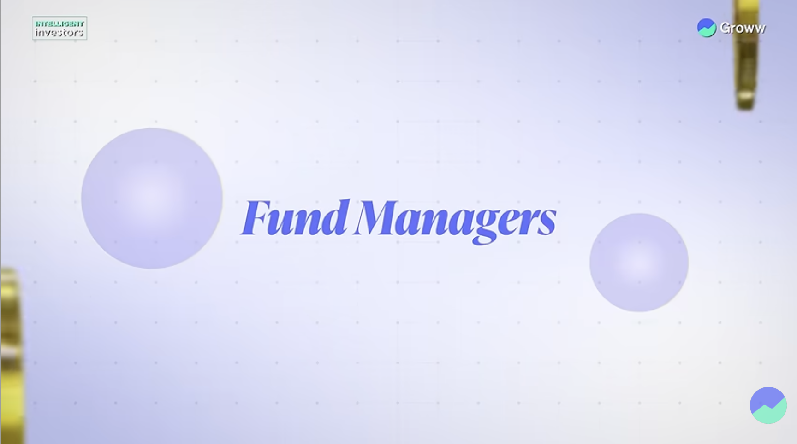

*Fig. 16 --- Only text. The next sub-topic card, again built the same
way.*

-   Again, in the next frame, only text is used.

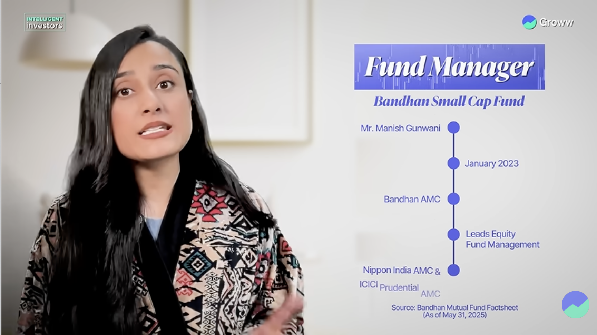

*Fig. 17 --- The founder\'s journey drawn as a progressive line with
dots, each dot an important beat.*

-   To visualise the journey of the founder or owner, use a progressive
    animation of a line with dots.

-   Each dot emphasises an important part of their fund-managing
    journey.

-   The same colour elements are reused here for continuity with the
    rest of the video.

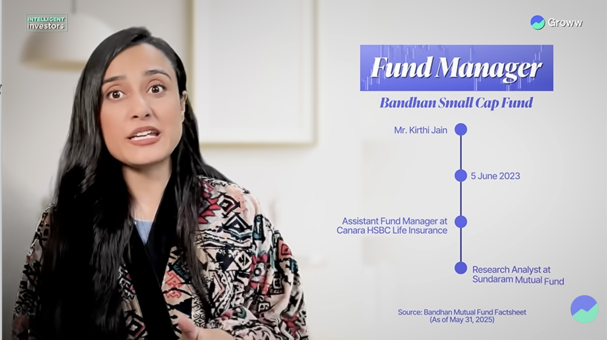

*Fig. 18 --- The same frame reused to continue the owner\'s journey.*

-   The same kind of frame continues the journey of the owner.

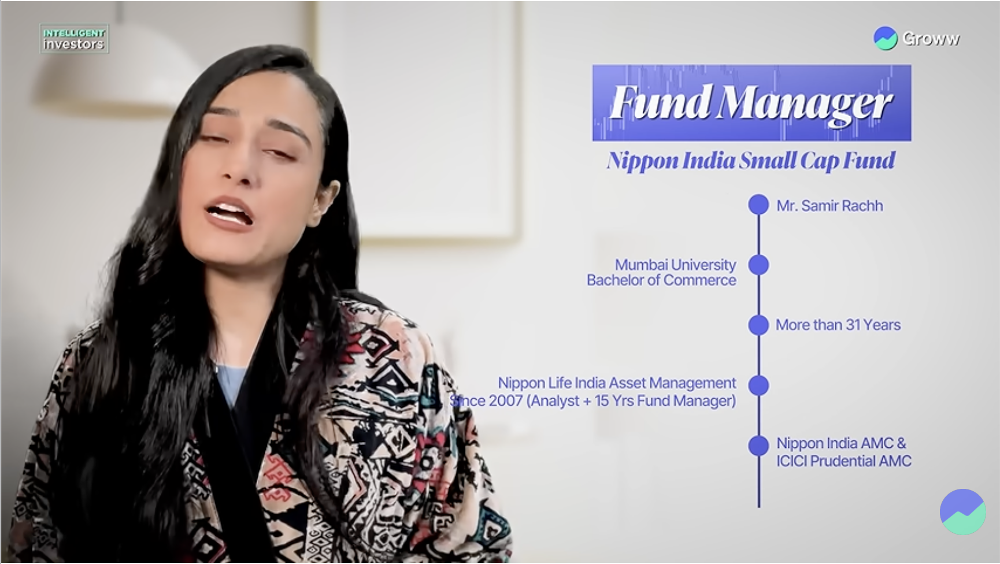

*Fig. 19 --- The same frame again for the other company\'s founder.*

-   The same frame is used again for the other company\'s founder\'s
    journey.

**Investment approach**

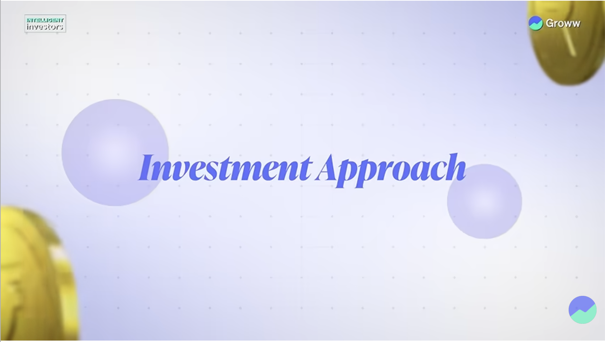

*Fig. 20 --- The next sub-topic, treated with the same card.*

-   The next frame is again treated as a topic card, with the same
    construction.

**§8 Tables, graphs and screenshots**

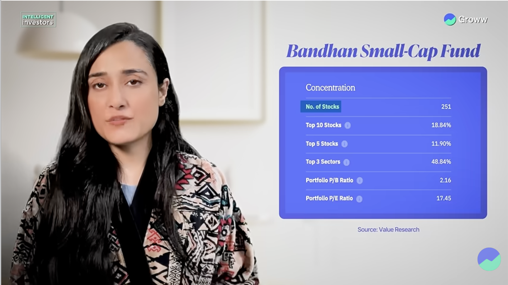

*Fig. 21 --- Creator with motion graphics. The concentration table on
screen, source credited underneath.*

-   **MANDATORY.** These are the tables shown on screen. For every Groww
    video, tables will be shown, because they are part of the script.

-   For every table, graph or news-element screenshot in the script, it
    is depicted in the video in this way. It is always part of the
    process of editing a Groww video.

-   The source line stays on screen with the table.

**Weightage**

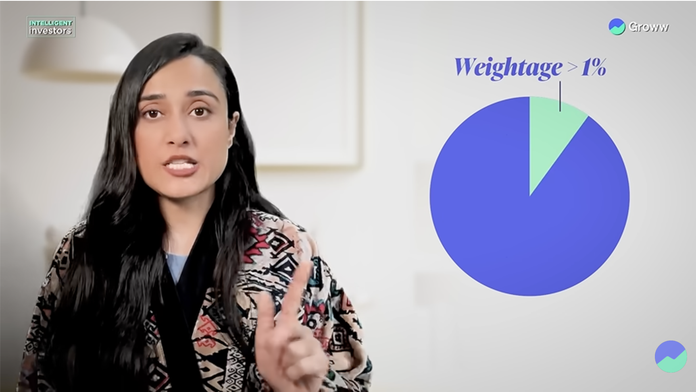

*Fig. 22 --- Creator with motion graphics. Weightage pie, creator kept
in frame as a creative choice.*

-   The next frame is about weightage. Here the creator is also put in
    frame as a creative choice.

-   Note again that colour branding is always used.

**B-roll with black edges**

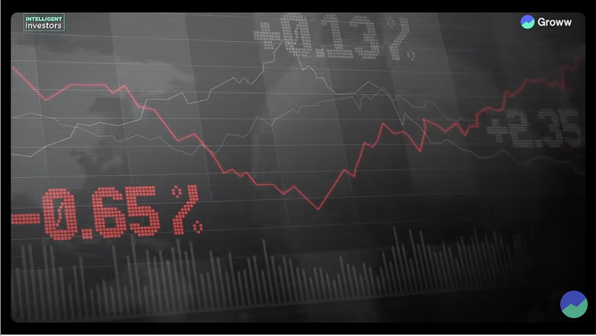

*Fig. 23 --- B-roll used with black edges on all four sides.*

-   In this frame, B-roll is used with black edges.

**Back to the table with the creator**

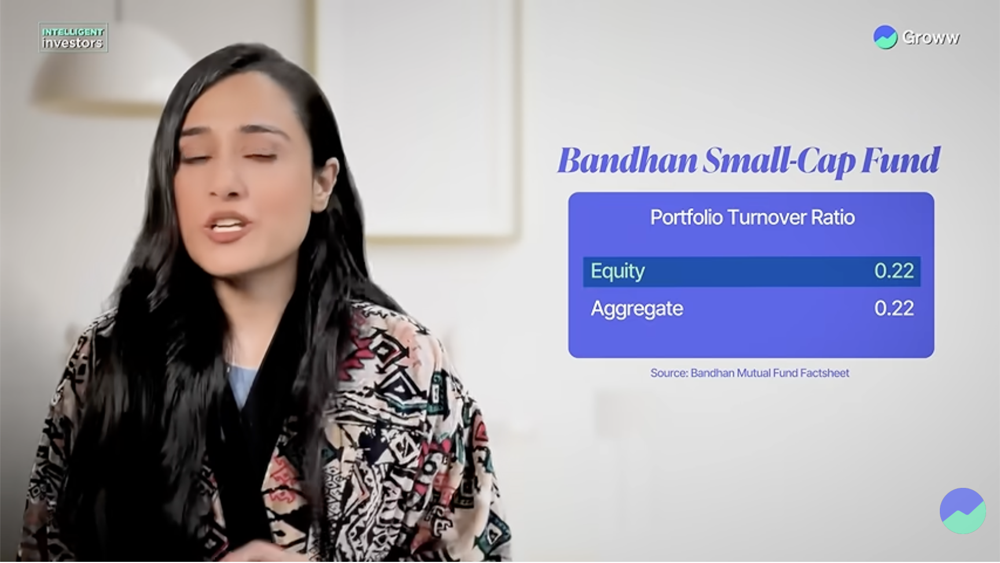

*Fig. 24 --- Creator with motion graphics again. Portfolio turnover
ratio.*

-   Again, the table with the creator.

**§9 Transitions**

+----------------------------------------------------------------------+
| **Weight this equally**                                              |
|                                                                      |
| Transitions are as important as the scenes themselves. A deep        |
| analysis of the transitions is a required deliverable, not an        |
| afterthought.                                                        |
+----------------------------------------------------------------------+

  --------------------------------------------- -------------------------------------------------------------------------------------------------------------------------
  **Where**                                     **Transition**
  **A-roll → B-roll**                           Zoom in or zoom out. Optionally a light leak in the brand\'s primary colour.
  **B-roll → A-roll**                           The same zoom treatment, reversed.
  **End of instruction section → main video**   The supplied default Groww brand transition. The script marks the exact point.
  **Icon beat → pie graph**                     The icons shrink, move together, retitle, then dissolve out before the pie animates in.
  **Section → sub-topic card**                  Straight into the topic card on the same background, with coins rotating in.
  **Element entrances (within a frame)**        Bottom to top, with an in-animation on every element. Text resolves word by word, brand purple, right-to-left in place.
  --------------------------------------------- -------------------------------------------------------------------------------------------------------------------------

When you audit the reference videos, log every transition you find with
its in-point, its type, its duration and what triggered it in the
voice-over. Anything not in the table above is a finding to bring back.

**§10 The workflow --- installing and running the gauntlet loop**

The transcript training is done. From here, every long video runs
through the same workflow, and the workflow is driven by the
gauntlet-loop skill.

**10.1 Install the skills**

Six skills are required. grill-me establishes the context; the gauntlet
loop drives the workflow; the two keying skills produce every creator
plate it will be judging; the two motion skills raise the craft of
everything that moves.

  ------------------------------ -------------------------------------------------------------------------------------------------------------------------------------
  **Skill**                      **Role**
  **grill-me**                   Gets you relentlessly interviewed about the plan until every branch of the design tree is resolved. Runs first, every time (§10.2).
  **gauntlet-loop**              Drives the whole workflow --- sets the bar, splits the work, runs builder and harsh critic on each piece, loops until ours wins.
  **corridorkey-green-screen**   Primary green-screen key on every creator plate that reaches the final cut (§4.1).
  **ffmpeg-chromakey**           Fast keys, batch passes, spill suppression, colour work, and the sample stills for the approval gate (§4.1).
  **emilkowalski-motion**        Motion craft on every animated element --- entrances, reveals, easing language (§3.6).
  **impeccable**                 Design discipline and deterministic anti-pattern audits, in brand mode. Run before the critic (§3.6).
  ------------------------------ -------------------------------------------------------------------------------------------------------------------------------------

grill-me repository: [[github.com/mattpocock/skills ---
skills/productivity/grill-me]{.ul}](https://github.com/mattpocock/skills/tree/main/skills/productivity)

+------------------------------------------------------------------------+
| git clone https://github.com/mattpocock/skills                         |
|                                                                        |
| cp -r skills/skills/productivity/grill-me your-project/.claude/skills/ |
+------------------------------------------------------------------------+

Gauntlet loop repository:
[[http://github.com/robonuggets/gauntlet-loop]{.ul}](http://github.com/robonuggets/gauntlet-loop)

+----------------------------------------------------------------------+
| git clone https://github.com/robonuggets/gauntlet-loop               |
|                                                                      |
| cp -r gauntlet-loop/.claude/skills/gauntlet-loop                     |
| your-project/.claude/skills/                                         |
+----------------------------------------------------------------------+

-   Verify the loop is loaded by typing /gauntlet-loop in a fresh
    session.

-   Install corridorkey-green-screen and ffmpeg-chromakey into the same
    .claude/skills/ directory, then verify each one resolves before you
    start keying.

-   Confirm ffmpeg is on PATH --- ffmpeg-chromakey shells out to it.

-   Install emilkowalski-motion and impeccable as set out in §3.6, and
    put impeccable in brand mode before the first frame is built.

-   Verify grill-me by typing /grill-me. It should open with a numbered
    round of questions, not with work.

**10.2 Grill first --- reach complete context before anything else**

+----------------------------------------------------------------------+
| **Run /grill-me before any other step**                              |
|                                                                      |
| Nothing is built off an assumption. Before the audit, before the     |
| key, before a single still is rendered, run /grill-me and let it     |
| interview you until it has the whole picture.                        |
+----------------------------------------------------------------------+

**How the session works:**

-   It maps the job as a design tree and works it in rounds. Each round
    it asks every question whose prerequisites are already settled ---
    numbered, each with its recommended answer --- and then waits for
    you.

-   Finding facts is the agent\'s job, never yours. If a question can be
    answered by reading the script, the factsheet, the reference video
    or the brand assets, it goes and finds the answer instead of asking
    you for it.

-   The decisions are yours. Every one is put to you, and it waits.

-   Your answers reshape the tree --- settled decisions push the
    frontier outward and unblock the questions that depended on them.

-   **The session ends only when the frontier is empty:** every branch
    visited, nothing silently assumed. It does not act on any of it
    until you confirm you have reached a shared understanding.

**It must have all of this nailed down before it moves on:**

-   Which funds are being compared, which factsheet dates apply, and
    which source is cited for each number on screen.

-   Where in the script the instruction section ends and the main video
    begins --- the exact line that triggers the default brand
    transition.

-   Every table, tabular column, graph, news element and screenshot the
    script contains, since all of them are mandatory on screen (§1).

-   Every Hinglish voice-over line that opens a sub-topic, since each
    one triggers a topic card.

-   Which assets are being supplied versus built: the disclaimer card,
    the default transition video, the creator plates, the B-roll.

-   Anything in this script that this sheet does not already cover ---
    that is exactly what grill-me exists to surface.

**10.3 What the gauntlet loop does, and why this sheet is shaped for
it**

-   **It sets a bar.** The skill refuses a vague target. The bar must be
    named, fetchable and comparable. §12 supplies three named, fetchable
    videos --- that is the bar, already prepared.

-   **It splits the work into judgeable pieces.** This sheet has already
    done the split: eight frame types (§11), plus the transitions (§9),
    plus each mandatory unit (§1), plus the key and the composite (§4)
    --- the key is its own judgeable piece, because a green-fringed edge
    loses the blind comparison on its own.

-   **It runs a builder and a separate harsh critic on each piece.** The
    critic has fresh context and never knows how hard the builder tried.

-   **It compares blind.** Our still goes next to the reference frame
    with the labels stripped, and the critic picks one. A pick, never a
    score out of ten --- scores drift upward every round.

-   **It loops until ours wins.** The exit condition is winning the
    blind comparison, or you stopping the run. Never a fixed number of
    rounds.

**10.4 The run order**

5.  Install the skills (§10.1) and open a fresh session with this sheet
    and the script attached.

6.  Run /grill-me and answer it out to an empty frontier (§10.2). Do not
    let it start work while a branch is still open.

7.  Inventory the script against §2 --- every table, screenshot, data
    point, source line and star marker, listed before any frame is
    designed. This list is what the finished edit is checked against.

8.  Audit the three reference videos in §12 frame by frame, in the way
    §5--§9 describe. Log every transition --- how it is used, its type,
    its duration and its trigger.

9.  Key the creator plates with corridorkey-green-screen and composite
    them onto the generated background (§4). Nothing else can be judged
    until the key is clean.

10. Read the script and decide which of the eight frame types (§11)
    belongs to which part of it, line by line.

11. Render sample stills for all eight frame types, off the real keyed
    composites --- not off mock-ups.

12. STOP at the approval gate (§13). Present the stills and the
    scene-to-script mapping. Do not proceed.

13. On approval, paste the prompt in §14 into a fresh session and let
    the gauntlet loop grind each piece until the critic picks ours
    blind.

**§11 The eight frame types**

There are eight types of scene, which is eight types of frame. Every
second of every long video is one of these. These are the judgeable
pieces the gauntlet loop fans out over.

  -------- --------------------------------------- ---------------------------------------------------------------------------------------- ----------------------
  **\#**   **Frame type**                          **When it is used**                                                                      **What dominates**
  **1**    Creator with text                       Emphasising something. A bare creator shot alone is the worst option in editing terms.   Text
  **2**    Creator with motion graphics            Any chart, screenshot or table in the script. Compulsory whenever one appears.           Motion graphics
  **3**    Creator with text and motion graphics   Complementing a highlighted line; explanatory passages.                                  Neither --- balanced
  **4**    Only text                               A sub-topic or topic that needs more emphasis.                                           Text
  **5**    Only motion graphics                    Quality lifts. Tables and graphs taken full screen with voice-over only.                 Motion graphics
  **6**    Only motion graphics and only text      One step beyond type 5.                                                                  Motion graphics
  **7**    B-roll, AI generated                    Visually pleasing cutaways.                                                              Footage
  **8**    B-roll, real footage                    Visually pleasing cutaways from real clips.                                              Footage
  -------- --------------------------------------- ---------------------------------------------------------------------------------------- ----------------------

**1) Creator with text**

*Type 1 --- Creator with text.*

-   Used when something is being emphasised.

-   In editing terms, showing a blank creator shot alone is the worst
    option. A frame like this proves far more efficient.

**2) Creator with motion graphics**

*Type 2 --- Creator with motion graphics.*

-   Comes up whenever there is a chart, screenshot or table in the
    script.

-   **Compulsory:** if there is any tabular column, screenshot or table
    in the script, it must be shown.

-   Note that creator-with-motion-graphics also comes with text. Because
    it is a motion-graphics frame with the creator, the motion graphics
    take the major part compared to the text.

**3) Creator with text and motion graphics**

*Type 3 --- Creator with text and motion graphics.*

*Type 3 --- also used when something is being explained.*

-   Just like the first type, but with complementing motion graphics
    tied to the text being highlighted.

-   No text or graphic dominates the other. They are balanced.

-   Also used when there is some explaining going on.

**4) Only text**

*Type 4 --- Only text.*

-   Scenes with these frames are dominantly text alone.

-   Mostly used when there is a sub-topic or topic that needs to be
    emphasised more.

**5) Only motion graphics**

*Type 5 --- Only motion graphics.*

-   Scenes with frames like this generally lift the video\'s quality. A
    lot of precision and easing in and out is required.

-   It does not mean text will not come --- it means the motion graphics
    take centre stage.

-   For the tables and graphs specified in the script, you can go one
    step further and show them full screen without the creator, with
    voice-over only. That choice is creative freedom.

**6) Only motion graphics and only text**

*Type 6 --- Only motion graphics and only text.*

-   This is going one step further than type 5.

**7) B-roll, AI generated**

*Type 7 --- B-roll, AI generated.*

-   Visually pleasing frames. With a little dust or texture in them,
    they become more visually pleasing still.

-   Including this often will be great, and it is easy through
    Higgsfield or the Kie AI MCP.

**8) B-roll, real footage**

*Type 8 --- B-roll, real footage.*

-   Equally pleasing, and the same thing goes for this one.

-   Framing, dust and texture all apply here too.

**§12 Reference videos --- the quality bar**

+----------------------------------------------------------------------+
| **This is the bar the gauntlet loop compares against**               |
|                                                                      |
| The bar must be named, fetchable and comparable. These three videos  |
| are all three. Pull the actual videos and compare against the real   |
| frames --- never against a description of them.                      |
|                                                                      |
| If the agent cannot obtain the reference, it will hallucinate the    |
| comparison and approve everything. That is the single most common    |
| way this loop fails.                                                 |
+----------------------------------------------------------------------+

**Primary bar**

[[Bandhan Small Cap Fund vs Nippon India Small Cap
Fund]{.ul}](https://youtu.be/ApidfQ73dMI?si=_gPmtSfZVTZ35Egg)

-   Look at this video and do this same detailed audit for a long video.

-   Every still in §5--§8 of this sheet is taken from it. That audit was
    done to show you how the long video should actually be.

**Secondary bars**

[[Top 6 Mutual Fund Types For Minimum Portfolio
Overlap]{.ul}](https://youtu.be/t_LzkOZA5SQ?si=o9ZHyO0ItK-OJTCp)

-   Do a similar type of audit on this video too.

[[Top 3 Arbitrage Funds in 2026
Compared]{.ul}](https://youtu.be/7UxrXvcd2Eg?si=1BDHxlUf_kxastjo)

-   Do the same audit on this one.

+----------------------------------------------------------------------+
| **The audit brief**                                                  |
|                                                                      |
| Do a deep frame-by-frame analysis of all these videos in the way     |
| described in §5--§8, and look very carefully at how they have used   |
| the transitions too.                                                 |
|                                                                      |
| There are eight types of scene, which is eight types of frame (§11). |
| Classify every frame in every reference video into one of them, and  |
| record what triggered each cut in the voice-over.                    |
+----------------------------------------------------------------------+

**§13 The approval gate**

+----------------------------------------------------------------------+
| **Hard stop --- do not pass without a yes**                          |
|                                                                      |
| 1\. Analyse the script, then decide which scene type goes to which   |
| part of the script.                                                  |
|                                                                      |
| 2\. Give me samples of all of these types of frames, as stills.      |
|                                                                      |
| 3\. Give a deep analysis of the transitions. Transitions are as      |
| important as the scenes.                                             |
|                                                                      |
| 4\. Only after I approve do you go ahead.                            |
+----------------------------------------------------------------------+

**What to present at the gate:**

-   Eight sample stills, one per frame type, rendered at final
    resolution with the logo lock-up in place.

-   The keyed composite: at least one creator still at 100% and one edge
    crop at 400%, showing hair and jacket edge with no green spill, over
    the generated background.

-   The scene-to-script map: every line of the script assigned a frame
    type, with the reason.

-   The transition analysis: every transition in the plan, its type,
    duration, and the voice-over trigger, cross-referenced against what
    the reference videos actually do.

-   The §2 asset inventory: every table, graph, screenshot, data point,
    source line and star marker in the script, each mapped to the frame
    and the line of dialogue it lands on --- proving none were dropped.

-   A data-accuracy pass: every figure destined for screen, set beside
    the script value it came from, character for character.

**§14 The paste-ready gauntlet prompt**

Run /gauntlet-loop with the goal below, or paste this prompt straight
into a fresh session once the approval gate in §13 has been cleared.
Replace the bar with the secondary references in §11 when you run those
audits.

+----------------------------------------------------------------------+
| Build a full scene-by-scene edit plan for a Groww \"Intelligent      |
| Investors\" long-form                                                |
|                                                                      |
| mutual fund video from the attached script, using the eight frame    |
| types, the brand                                                     |
|                                                                      |
| system and the transition rules in the attached instruction sheet.   |
| Key the creator                                                      |
|                                                                      |
| plates with corridorkey-green-screen, clean up and batch with        |
| ffmpeg-chromakey, and                                                |
|                                                                      |
| composite onto a generated background. Build every animation with    |
|                                                                      |
| emilkowalski-motion and audit every frame with impeccable in brand   |
| mode before                                                          |
|                                                                      |
| it goes to the critic.                                               |
|                                                                      |
| Before you build anything, run /grill-me and interview me until the  |
| frontier is                                                          |
|                                                                      |
| empty. Assume nothing about the script, the funds, the sources, the  |
| supplied assets                                                      |
|                                                                      |
| or the brief. Look up every fact yourself; put every decision to me  |
| and wait.                                                            |
|                                                                      |
| Section 2 of the sheet is not negotiable. The creator never speaks   |
| the tables,                                                          |
|                                                                      |
| screenshots or sources - they are in the script for you to put on    |
| screen. Every one                                                    |
|                                                                      |
| of them reaches the final edit, character-for-character accurate,    |
| with its source                                                      |
|                                                                      |
| line visible beneath it and its star marker shown, landing on the    |
| exact line of                                                        |
|                                                                      |
| dialogue it belongs to. Keep the screen moving: dissect a data point |
| into steps                                                           |
|                                                                      |
| rather than holding a static frame. Where the data is a candlestick  |
| chart or a line                                                      |
|                                                                      |
| graph, reproduce the curve point for point - no smoothing, no        |
| rescaled axes, no                                                    |
|                                                                      |
| dropped series.                                                      |
|                                                                      |
| The bar is the published Groww video \"Bandhan Small Cap Fund vs     |
| Nippon India Small                                                   |
|                                                                      |
| Cap Fund\" at https://youtu.be/ApidfQ73dMI. Pull the actual video,   |
| step it frame by                                                     |
|                                                                      |
| frame, and compare against those real frames directly, not against a |
| description                                                          |
|                                                                      |
| of them.                                                             |
|                                                                      |
| Break this into the smallest pieces that can be judged on their own  |
| - the                                                                |
|                                                                      |
| disclaimer, the hook, the key and the composite, each of the eight   |
| frame types, the                                                     |
|                                                                      |
| background system, the type system, the callout boxes, every table,  |
| and every                                                            |
|                                                                      |
| transition. For each piece, fan out a builder and a separate critic  |
| with fresh                                                           |
|                                                                      |
| context. The critic renders our still, puts it next to the reference |
| frame blind                                                          |
|                                                                      |
| with the labels stripped, says which one is the real Groww frame,    |
| and names the                                                        |
|                                                                      |
| single biggest remaining gap. Then it goes back to the builder.      |
|                                                                      |
| The critic should be a harsh critic. Praise is not useful. If ours   |
| does not win, it                                                     |
|                                                                      |
| keeps going.                                                         |
|                                                                      |
| /loop on each piece until the critic picks ours blind. Do not stop   |
| before that.                                                         |
|                                                                      |
| Keep a live progress page updating as the work evolves so I can      |
| watch it.                                                            |
|                                                                      |
| Fan out subagents and ultracode.                                     |
+----------------------------------------------------------------------+

**If you are running a different agent**

/loop and ultracode are Claude Code features. On any other agent, swap
the last two lines for: "Keep looping until the critic picks ours. Run
the builders and critics as parallel subagents." The structure carries
over unchanged.

**What breaks this loop**

-   **A vague bar.** The critic invents a comparison and approves
    everything. By far the most common failure --- this is why §12 names
    actual URLs.

-   **The builder judging its own work.** The critic must be a separate
    agent with fresh context.

-   **A soft critic.** Give it a binary job: which one is the real Groww
    frame, A or B.

-   **A named exit after N rounds.** The exit is winning the comparison,
    or you stopping the run.

-   **Skipping the approval gate.** §13 is a hard stop. Stills first,
    approval second, build third.

-   **A dropped table or a missing source.** The critic is comparing
    craft; it will happily approve a beautiful frame that silently lost
    a data point. §2 is checked separately, by inventory, not by taste.

-   **Starting before grill-me is finished.** A loop run on a wrong
    assumption converges beautifully on the wrong video. Empty the
    frontier first (§10.2).
